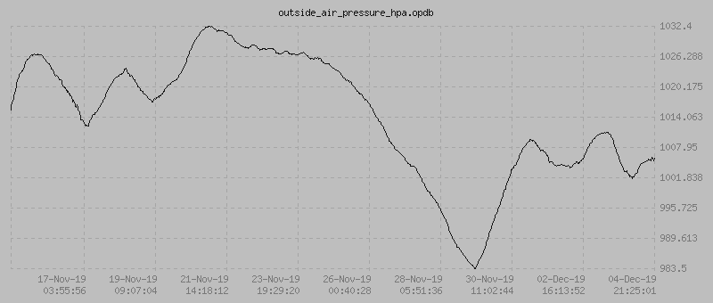

# opdb
A no-frills database and grapher for simple sequential logging.

The database, loosely termed, is a headerless binary file consisting of 12-byte value/time pairs: a float that stores a value logged on an occasion, and an int64 that records the time (milliseconds since epoch) of the occasion.

## Usage
Currently, opdb is made up of two components: `opdb` and `opdb_graph`. The former is used to interact with the database file, and the latter to produce graphs of logged data.

The following command-line command will log the value `50.2` into the file `thing.opdb`:

    $ opdb log thing.opdb 50.2
    
To get a raw printout of the contents of `thing.opdb`:

    $ opdb print thing.opdb
    1. [Sat Jan 26 08:07:14 2019] 50.2
    
A PNG graph can be produced in this manner:

    $ php opdb_graph_cli.php -i thing.opdb -o thing.png -w 250 -h 150 -d 1
    
(You can find a list of the command-line parameters accepted by `opdb_graph_cli.php` in that file.)

## Requirements
PHP 7 with PHP GD and CLI.
